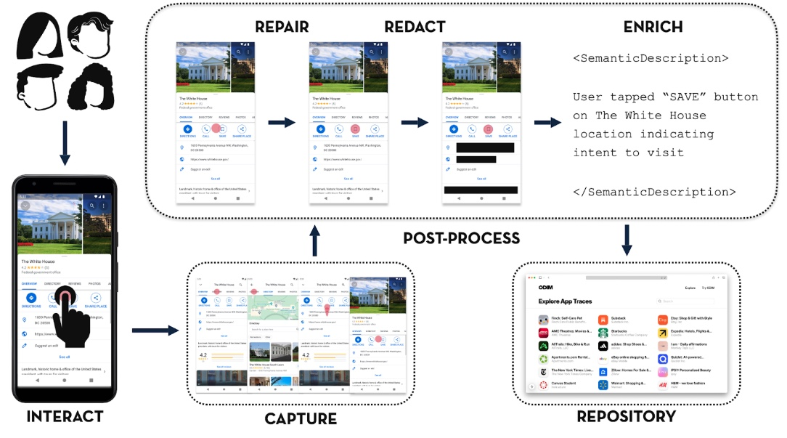

<div align="center">
  <h2>ODIM Android</h2>
  <p>On-Device Interaction Mining for Android — capture, curate, and upload interaction traces for research.</p>
  
  <p>
    <a href="https://shields.io/">
      
    </a>
    <a>
      
    </a>
    <a>
      
    </a>
    <a>
      
    </a>
    <a>
      
    </a>
    <a href="LICENSE">
      
    </a>
  </p>
  
  <p>
    <a href="#about">About</a>
    · <a href="#getting-started">Getting Started</a>
    · <a href="#configuration">Configuration</a>
    · <a href="#storage-layout">Storage</a>
    · <a href="#privacy--permissions">Privacy</a>
    · <a href="#networking">Networking</a>
    · <a href="#dependencies">Dependencies</a>
    · <a href="#contact">Contact</a>
    · <a href="#citation">Citation</a>
  </p>
</div>

<p align="center">
  
</p>

## About

ODIM (On-Device Interaction Mining) is an Android app that captures user interactions across installed apps to generate traces for research and analysis. It runs an AccessibilityService to observe interaction events and, on each relevant touch, records:

- a full-screen screenshot
- the view hierarchy (VH) at that moment as JSON
- a lightweight gesture record describing where and how the user interacted

Captured data is organized locally on-device and can be reviewed, curated (redact sensitive UI text), edited (fix incomplete gestures), and uploaded to a server.


## Highlights

- Capture cross-app interaction traces with screenshots, view hierarchy, and gestures
- Curate traces: redact sensitive UI text/regions and fix incomplete interactions
- Associate traces with capture tasks via QR codes
- Split traces into new flows and upload full traces to a server


## Tech stack

- **Language**: Kotlin 1.7.x
- **Concurrency**: Kotlinx Coroutines
- **UI**: AndroidX, Material Design, RecyclerView, ViewBinding, ConstraintLayout
- **Camera**: CameraX and ML Kit (barcode-scanning) for QR code scanning
- **Networking**: OkHttp (+ logging interceptor), Jackson (Kotlin module), Kotlinx Serialization


## Project layout

Top-level layout (this directory):

- `app/` – the main Android application module
- `gradle/`, `gradlew*`, `settings.gradle`, `build.gradle`, `LICENSE`, `CODEOWNERS`

Module structure (`app/src/main/java/edu/illinois/odim`):

- `activities/` – entry points and screens for browsing, editing, and uploading captures
- `adapters/` – RecyclerView adapters for list UIs
- `dataclasses/` – data models persisted locally and exchanged with the server
- `fragments/` – custom views/overlays used by activities
- `utils/` – storage, upload, and screen dimension helpers
- `CoreAccessibilityService.kt` – the core AccessibilityService implementation (`MyAccessibilityService`)

Android resources live in `app/src/main/res/` (layouts, drawables, strings, menus, themes, etc.).


## How it works

1) Enable the ODIM accessibility service. When the user interacts with other apps, `MyAccessibilityService` listens for events and on first touch of a screen:

- takes a screenshot
- serializes the current view hierarchy tree to JSON
- infers an initial gesture label (click, long click, scroll, or unknown) and stores normalized coordinates
- groups screens into a "trace" per target app

2) Browse on-device captures in the ODIM app:

- `AppActivity` shows installed app packages that have captured traces
- `TraceActivity` shows traces for a selected app (label is the timestamp of first screen; task metadata is shown if present)
- `EventActivity` shows the sequence of captured screens (events) in a grid; from here you can:
  - open a screen to redact sensitive text or UI regions
  - fix incomplete gestures (when the service couldn't infer a unique target)
  - split selected screens into a new trace
  - delete selected screens
  - upload the full trace to the server

3) Redact or edit details:

- `ScreenShotActivity` overlays VH bounding boxes over the screenshot; you can redact text via a list of VH nodes or draw redaction rectangles and save them
- `IncompleteScreenActivity` helps resolve incomplete gesture events by selecting the intended VH node and defining the gesture type (click/long click/scroll)

4) Upload a trace:

- From `EventActivity`, ODIM uploads each screen (image + VH) and a metadata document describing gestures and redactions via `UploadDataOps`


## Getting started

Requirements:

- Android Studio (AGP 8.6.x), Kotlin 1.7.x
- minSdk 30, targetSdk 33, compileSdk 34

Steps:

1) Clone the repository from [interaction-mining](https://github.com/datadrivendesign/interaction-mining) and open this directory in Android Studio.
2) Build the project and install the `app` module.
3) Launch ODIM on your device or emulator.
4) From `CaptureActivity`, scan a QR code to load a capture task (optional).
5) Turn on the ODIM accessibility service in system settings (Settings → Accessibility → ODIM → On).
6) Use your device normally; ODIM will capture screens for non-ODIM apps you interact with.

**To get a visual step by step example, see [our website's instructions](https://www.interactionmining.org/contribute)**

## Configuration

- Base URL is defined via `BuildConfig.API_URL_PREFIX`:
  - Debug: `${API_URL_PREFIX}` Gradle property or defaults to `https://dev.interactionmining.org`
  - Release: `${API_URL_PREFIX}` Gradle property or defaults to `https://interactionmining.org`
- `usesCleartextTraffic` is set via manifest placeholders (enabled for debug, disabled for release).

To override the base URL, set a Gradle property when building:

```
API_URL_PREFIX=https://your.server
```


## Storage layout

All captured data is stored under the app's internal storage, rooted at `files/TRACES`.

Directory pattern:

`TRACES/<appPackage>/<traceLabel>/<eventLabel>/`

Within each `eventLabel` directory:

- `<eventLabel>.png` – the screenshot
- `vh-<eventLabel>.json` – the view hierarchy at capture time
- `gesture-<eventLabel>.json` – the normalized gesture (when available)
- `redact-<eventLabel>.json` – accumulated redactions for this screen

Trace-level metadata:

- `TRACES/<appPackage>/<traceLabel>/task.json` – `CaptureStore { id, description }` set when the trace is associated with a capture task

Key helpers in `utils/LocalStorageOps.kt` provide file I/O for listing apps/traces/events, saving and renaming artifacts, and splitting selected events into a new trace.


## Activities

- [`CaptureActivity`](app/src/main/java/edu/illinois/odim/activities/CaptureActivity.kt) – starting point for ingesting a capture task by scanning a QR code; shows task instructions and shortcuts to enable accessibility and launch the target app
- [`ScannerActivity`](app/src/main/java/edu/illinois/odim/activities/ScannerActivity.kt) – camera-based QR code scanner using CameraX and ML Kit; launched by `CaptureActivity` to scan capture task QR codes
- [`AppActivity`](app/src/main/java/edu/illinois/odim/activities/AppActivity.kt) – lists apps that have captured traces; navigate into traces or multi-select to delete app data
- [`TraceActivity`](app/src/main/java/edu/illinois/odim/activities/TraceActivity.kt) – lists traces for the chosen app; shows task description and number of screens; supports multi-select delete
- [`EventActivity`](app/src/main/java/edu/illinois/odim/activities/EventActivity.kt) – grid of events (screens) for a trace; supports edit gesture, split trace, delete screens, and upload trace
- [`ScreenShotActivity`](app/src/main/java/edu/illinois/odim/activities/ScreenShotActivity.kt) – redact screen contents using VH-driven text selection or freeform rectangles; updates both VH JSON and PNG
- [`IncompleteScreenActivity`](app/src/main/java/edu/illinois/odim/activities/IncompleteScreenActivity.kt) – resolve incomplete or unknown gestures: choose a VH candidate and gesture type; persists updated gesture and renames the event accordingly


## Accessibility service

- `MyAccessibilityService` (declared as a `<service>` in `AndroidManifest.xml`) captures:
  - package transitions to segment traces
  - screenshots and VH on touch
  - gestures from `AccessibilityEvent` to label interactions
  - writes to on-device storage via `LocalStorageOps`
- Monitors accessibility events: `typeViewClicked`, `typeViewLongClicked`, `typeViewSelected`, `typeViewFocused`, `typeViewScrolled`
- Service configuration defined in `res/xml/accessibility_service_config.xml`


## Privacy & permissions

- Permissions: `INTERNET`, `ACCESS_NETWORK_STATE` (uploads), `CAMERA` (QR), `QUERY_ALL_PACKAGES` (enumerate app directories for display)
- Data stays on-device under `files/TRACES` until the user explicitly uploads a trace
- Screenshots and VH are only captured for non-ODIM apps; system UI and the launcher are excluded


## Key packages and components

- `activities/` – `CaptureActivity`, `ScannerActivity`, `AppActivity`, `TraceActivity`, `EventActivity`, `ScreenShotActivity`, `IncompleteScreenActivity`
- `adapters/` – `AppAdapter`, `TraceAdapter`, `EventAdapter`, `VHAdapter`
- `dataclasses/` – `Gesture`, `GestureCandidate`, `Redaction`, `ScreenShotPreview`, `CaptureStore`, `CaptureTask`, `CaptureData`, `TaskData`, `AppItem`, `TraceItem`, `VHItem`
- `fragments/` – overlays and floating widgets (e.g., `ScrubbingScreenshotOverlay`, `MovableFloatingActionButton`, `IncompleteScreenCanvasOverlay`)
- `utils/` – `LocalStorageOps`, `UploadDataOps`, `ScreenDimensionsOps`


## Networking

- Uploads use `UploadDataOps` with base URL from `BuildConfig.API_URL_PREFIX`.
- Endpoints:
  - `POST /api/capture/{captureId}/upload/frames`
  - `POST /api/capture/{captureId}/upload/metadata`


## Dependencies

- **AndroidX Core Libraries**: `core-ktx`, `appcompat`, `material`, `constraintlayout`
- **CameraX** (`androidx.camera:*`) – camera preview and image analysis
- **Google ML Kit** (Barcode Scanning) – QR code detection
- **OkHttp** (+ logging interceptor) – HTTP client for uploads
- **Jackson** (Kotlin module) – JSON serialization/deserialization
- **Kotlinx Serialization** – JSON serialization for Kotlin data classes
- **Kotlinx Coroutines** – asynchronous programming
- **Coroutines OkHttp** – OkHttp integration with coroutines

## Contact

Developed by the Data-Driven Design Group at the University of Illinois Urbana-Champaign. For research collaborations or academic inquiries, visit the [project website](https://interactionmining.org) or [Prof. Ranjitha Kumar’s page](https://ranjithakumar.net/).

For questions, bug reports, or support, please open an issue on the repository’s [GitHub Issues](https://github.com/datadrivendesign/interaction-mining/issues) page.

For sensitive inquiries (e.g., security concerns), contact <carlguo2@illinois.edu>.


## License

University of Illinois/NCSA Open Source License. See `LICENSE`.

## Citation

Our paper can be found [here](https://dl.acm.org/doi/10.1145/3743726). If you use ODIM in your work, please consider citing:

```bibtex
@article{10.1145/3743726,
author = {Arsan, Deniz and Guo, Carl and Wellyanto, Muhammad Rizky and Ji, Erik R and Talton, Jerry O. and Kumar, Ranjitha},
title = {On-Device Interaction Mining},
journal = {Proc. ACM Hum.-Comput. Interact.},
volume = {9},
number = {5},
articleno = {MHCI024},
year = {2025},
month = sep,
doi = {10.1145/3743726},
url = {https://doi.org/10.1145/3743726},
}
```
